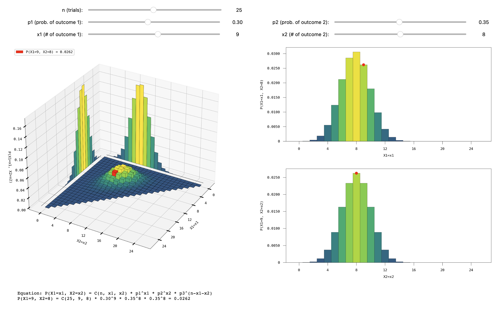
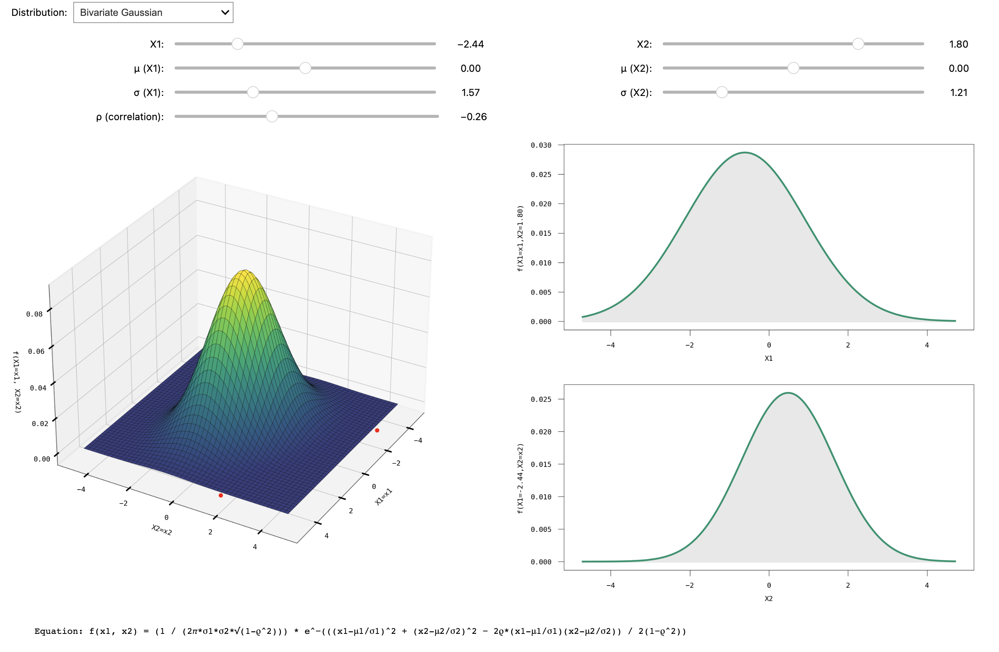

# Interactive Probability Learning

Welcome to the Interactive Probability Learning Project. This repository aims to provide intuitive visualizations and understanding of various Probability Distribution Functions (PDFs) and Probability Mass Functions (PMFs).

## Table of Contents
- [Directory Structure](#directory-structure)
- [Changelog](#changelog)
- [Usage](#usage)
- [Example Visualizations](#example-visualizations)
- [Contributing & Feedback](#contributing--feedback)
- [License](#license)

## Directory Structure

- `pdf_pmf_visualization/`: Contains the main visualization tools. 
  - `continuous_pdf_2d_visualization/`: A 2D visualizer for continuous probability distributions.
  - `continuous_pdf_3d_visualization/`: A 3D visualizer for continuous probability distributions.
  - `discrete_pmf_2d_visualization/`: A 2D visualizer for discrete probability mass functions.
  - `discrete_pmf_3d_visualization/`: A 3D visualizer for discrete probability mass functions.
  - `assets/`: Contains various assets for the project such as example images.

## Changelog
**Version 0.5.4** (2023/10/16)
Fixed several bugs in `continuous_pdf_2d_visualization` and added `possion approximation` & `binomial approximation` in `discrete_pmf_2d_visualization`.

**Version 0.5.3** (2023/10/14)
Improve the overall user experience in interactive visualizations.

**Version 0.5.2** (2023/10/10)
Added `tri-hypergeometric` in `continuous_pdf_3d_visualization`.

**Version 0.5.1** (2023/10/05)
Improved the overall user experience in interactive visualizations.

**Version 0.5.0** (2023/10/04)
Added `continuous_pdf_3d_visualization`.

**Version 0.4.1** (2023/10/03)
Fixed several bugs in `continuous_pdf_2d_visualization`.

**Version 0.4.0** (2023/10/02)
Added `continuous_pdf_2d_visualization`.

**Version 0.3.1** (2023/10/01)
Fixed several bugs in `discrete_pmf_3d_visualization`.

**Version 0.3.0** (2023/09/30)
Added `discrete_pmf_3d_visualization`.

**Version 0.2.1** (2023/09/28)
Fixed several bugs in `discrete_pmf_2d_visualization`.

**Version 0.2.0** (2023/09/26)
Added `discrete_pmf_2d_visualization`.

**Version 0.1.0** (2023/09/23)
Implemented the visualization framework.

## Usage

1. Clone the repository.
```
git clone https://github.com/J6mesQian/interactive-prob
```
2. Navigate to the desired sub-directory.
3. Follow the README within each sub-directory for detailed instructions.

## Example Visualizations

Here's an example of a trinomial distribution and bivariate gaussian distribution visualization





## Contributing & Feedback

Feel free to fork, submit pull requests, or provide feedback on any issues you might find. We appreciate your contributions to making this tool better.

## License

This software is open-source. Please check the `LICENSE` file in the root directory for more details.
